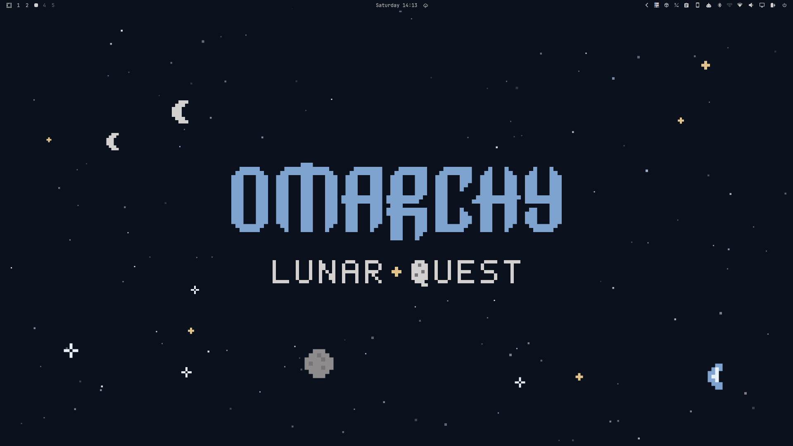

# Lunar Quest

An [Omarchy](https://omarchy.org/) theme drawn from Artemis II photographs of
the Moon: deep-space navy backgrounds, sunlit-regolith text, and the blue of
Earth's oceans rising over the lunar limb as the accent.



## Palette

Every core color was sampled from the photos in `backgrounds/`.

| Role | Color | Source |
|---|---|---|
| background | `#0a111d` | sky above the limb |
| foreground | `#d3d1cf` | sunlit regolith |
| bright foreground | `#e8f0f8` | Earth's cloud tops |
| accent / blue | `#7ea3cf` | Earth's oceans |
| selection | `#223855` | Earth's night side |
| muted | `#757478` | regolith in shadow |

The remaining ANSI colors are desaturated so they sit quietly against the
monochrome lunar surface.

## What it themes

- **Omarchy shell** (`shell.toml`): bar, menus, launcher, notifications,
  polkit prompt, lock screen and image picker, with Earth-blue focus and
  selection.
- **Windows** (`hyprland.lua`): borders fade from Earth blue to lunar
  highlight, and the focused window carries a soft blue glow, like
  earthshine on the Moon's night side. Corners are rounded to 8px; the
  Omarchy shell follows, so menus, popups and controls round to match. A
  `decoration.rounding` set in `~/.config/hypr/looknfeel.lua` still wins.
- **btop** (`btop.theme`): CPU graphs rise from Earth's night side to its
  cloud tops, memory meters use regolith greys, and temperature and usage
  warm from Earth blue through sunlight to red.
- **Everything else** Omarchy themes (terminals, Neovim, VS Code, Chromium
  browsers, Helix, Obsidian, keyboard RGB) is generated from `colors.toml`.

Requires Omarchy 4; see [COMPATIBILITY.md](COMPATIBILITY.md).

## Install

```bash
omarchy theme install https://github.com/vinicgobbi/omarchy-lunar-quest-theme
omarchy theme set "Lunar Quest"
```

### Restoring the window glow and rounded corners

For safety, Omarchy ignores any `*.lua` file in a theme installed from a git
repository, because Hyprland runs it as code. It tells you so on install:

```
Ignored in ~/.config/omarchy/themes/lunar-quest: hyprland.lua
```

Omarchy generates a plain `hyprland.lua` instead, so the border gradient
still works, but the earthshine glow and the rounded corners are lost. Read
[hyprland.lua](hyprland.lua) first, then pick one way to bring it back.

**Option 1: theme hook (recommended).** The hook copies the theme's
`hyprland.lua` into place each time Lunar Quest is applied and reloads
Hyprland. Other themes are untouched, and `omarchy theme update` keeps
working.

```bash
omarchy hook install theme-set \
  ~/.config/omarchy/themes/lunar-quest/hooks/theme-set.d/50-lunar-quest-hyprland
omarchy theme set "Lunar Quest"
```

To undo it, remove
`~/.config/omarchy/hooks/theme-set.d/50-lunar-quest-hyprland`.

**Option 2: make it your own theme.** Without its `.git` folder, Omarchy
treats the theme as one you wrote and loads every file. You lose
`omarchy theme update`; reinstall to get new versions.

```bash
rm -rf ~/.config/omarchy/themes/lunar-quest/.git
omarchy theme set "Lunar Quest"
```

**Option 3: for every theme.** Add the `decoration` block from
[hyprland.lua](hyprland.lua) to `~/.config/hypr/looknfeel.lua`. The glow and
corners then apply whatever theme is active.

## Backgrounds

0. `0-omarchy-lunar-quest.png` (default): the Omarchy wordmark over
   "Lunar Quest", where the Q becomes a cratered moon, among pixel stars,
   moons and a crescent Earth
1. The Edge of Two Worlds
2. A Setting Earth
3. A Terrain of Ancient Impacts
4. Over the Moon
5. Shadows Across Vavilov Crater
6. Artemis II Lunar Crescent View
7. `omarchy.png`: the stock Omarchy wordmark in the theme accent

Omarchy opens a theme on its first background in name order, so the `0-`
prefix makes the Lunar Quest wordmark the default.

Photos: NASA, Artemis II mission.

## Unlock screen

`unlock.png` is the mark shown on the Plymouth disk-unlock screen and the SDDM
login screen: the wordmark over "Lunar Quest", with the password field below
it in the theme foreground. `preview-unlock.png` is its picker preview.

```bash
omarchy plymouth set by theme lunar-quest
```

## Generated art

The wordmark wallpapers and `unlock.png` are generated from SVG by
`art/generate.py` (requires `rsvg-convert`). Edit the script, then run
`python3 art/generate.py` to rewrite `art/*.svg`, `backgrounds/omarchy*.png`,
`unlock.png` and `preview.png` (the theme picker preview, drawn from the
`omarchy-lunar-quest` wallpaper). Rebuild the unlock preview with
`omarchy plymouth preview '#0a111d' '#d3d1cf' unlock.png preview-unlock.png`.
`art/omarchy-logo.svg` is the Omarchy logo as shipped in
`/usr/share/omarchy/logo.svg`.

## Validation

`tests/validate-theme.sh` checks the palette and shell tokens, that
`hyprland.lua` and `shell.toml` repeat the border colors from `colors.toml`,
the image sizes, and that the generated art matches `art/generate.py`. CI runs
it on every push.

```bash
bash tests/validate-theme.sh
```

## Releases

Versions are bumped automatically by [Commitizen](https://commitizen-tools.github.io/commitizen/)
from [Conventional Commits](https://www.conventionalcommits.org/). After a
push to `main` passes validation, CI bumps the version in `.cz.toml`, adds a
section to [CHANGELOG.md](CHANGELOG.md), tags `vX.Y.Z` and pushes:

| Commit | Bump |
|---|---|
| `fix: ...` | patch |
| `feat: ...` | minor |
| `feat!: ...` or a `BREAKING CHANGE:` footer | major |
| `docs:`, `ci:`, `chore:`, `refactor:`... | none |

Write commits locally with `cz commit`, or preview the next bump with
`cz bump --dry-run`.

## License

MIT, see [LICENSE](LICENSE). The NASA photographs and the Omarchy wordmark are
not covered by it.
